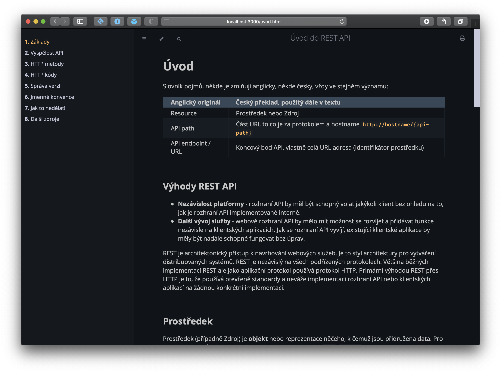
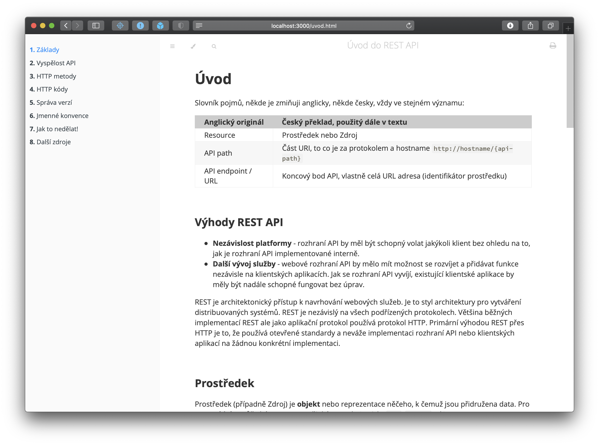

# Dokumentace pomocí mdBook

1. stáhněte si mdBook a uložte do nějakého adresáře, který máte nastavený v `PATH` proměnné, url ke stažení binárky je zde: https://github.com/rust-lang/mdBook/releases (nebo můžete zkusit `cargo install mdbook`, pokud máte nainstalované rust prostředí)

2. stáhněte si tento repozitář, např.:

```term
git clone git@gitlab.datalite.cz:docs/rest-api-recommendations.git
```

3. v terminálu (případně `cmd.exe` spusťte

```term
mdbook serve
```


Mělo by se objevit něco takového:

```term
❯ mdbook serve

2020-10-20 14:01:01 [INFO] (mdbook::book): Book building has started
2020-10-20 14:01:01 [INFO] (mdbook::book): Running the html backend
2020-10-20 14:01:01 [INFO] (mdbook::cmd::serve): Serving on: http://localhost:3000
2020-10-20 14:01:01 [INFO] (warp::server): Server::run; addr=V6([::1]:3000)
2020-10-20 14:01:01 [INFO] (warp::server): listening on http://[::1]:3000
2020-10-20 14:01:01 [INFO] (mdbook::cmd::watch): Listening for changes...
```
4. A pak už můžete procházet dokumentaci

__Dark theme__



__Light theme__

